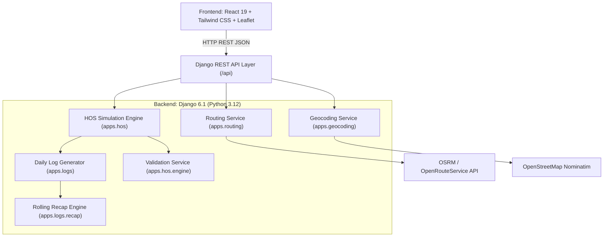

# Spotter ELD Route Planner

> A full-stack HOS-compliant route planning and automated Driver's Daily Log generation system.

The Spotter ELD Route Planner combines commercial truck route planning, deterministic FMCSA Hours of Service (HOS) scheduling, automated compliance validation, and ELD-style 24-hour Driver's Daily Log generation. Given dispatch coordinates and prior cycle duty hours, the engine computes real road corridors, inserts mandatory duty activities (fueling, 30-minute rest breaks, 10-hour sleeper rests, pickup, and dropoff), and renders auditable 24-hour daily logs with continuous rolling 70-hour/8-day recap tracking.

---

## 2. Key Features

- **Real Road Route Generation**: Geocoding and street routing powered by OpenRouteService with automated failover to Open Source Routing Machine (OSRM) and Haversine geometry.
- **Trip Route Planning (Origin → Pickup → Dropoff)**: Complete commercial trip planning across multiple legs with dispatch location resolution.
- **Automated HOS Scheduling**: Deterministic simulation of driver shifts, rest breaks, and duty windows enforcing 49 CFR Part 395 regulations.
- **11-Hour Daily Driving Limit Enforcement**: Strict tracking of cumulative shift driving; automatically halts driving and schedules qualifying rest.
- **14-Hour Duty Window**: Enforces maximum 14 consecutive hours of on-duty elapsed time following 10 consecutive hours off duty.
- **30-Minute Rest Break**: Automatically scheduled after 8 cumulative hours of driving without an interruption of at least 30 minutes.
- **70-Hour / 8-Day Rolling Cycle Tracking**: Dynamic calculation of cumulative on-duty hours across a rolling 8-day window.
- **34-Hour Restart Handling**: Identifies qualifying 34 consecutive hours off-duty periods that reset cycle hours back to 70.
- **Mandatory Fueling Stops**: Automated 30-minute on-duty fueling stops scheduled along the route corridor at least once every 1,000 miles.
- **Pickup & Dropoff Activities**: Dedicated 1-hour On-Duty (Not Driving) blocks for shipper loading and consignee unloading, plus vehicle inspections.
- **Sleeper Berth / Overnight Rest**: Automated 10 consecutive hours of off-duty/sleeper berth rest between consecutive shifts.
- **Timezone-Aware Scheduling**: Automatic location-based timezone resolution (Eastern, Central, Mountain, Pacific) ensuring local timestamp accuracy across state boundaries.
- **DST-Aware Timestamps**: UTC-normalized arithmetic converted to IANA timezone representations preserving Daylight Saving Time transitions.
- **Deterministic 24-Hour Driver's Daily Logs**: Renders 24-hour log sheets divided into 15-minute sub-intervals across all 4 standard ELD duty statuses.
- **Midnight Boundary Handling**: Automatic splitting of long activities traversing midnight (00:00) into distinct daily sheets.
- **Strict Log Validation**: Validation engine checks for exactly 24.0 hours per sheet, absence of negative durations, and zero overlapping intervals.
- **Proportional Mileage Distribution**: Calculates and assigns actual road miles traveled to the corresponding calendar day.
- **Driver Review & Approval Workflow**: Interactive driver portal to inspect planned logs, add duty remarks, review recap balances, and sign off.
- **HOS Validation & Violation Detection**: Independent schedule validator detecting driving limit breaches, window exceedances, and invalid rest intervals.
- **Historical 70/8 Data Sufficiency Detection**: Differentiates between complete 8-day driver histories and newly generated trips without historical baselines.
- **Transparent Rolling Recap Metrics**: Line-by-line FMCSA recap computation (Lines A, B, and C) detailing hours available tomorrow.
- **Simulation Mode Distinction**: Clearly labels simulated planned routes to maintain strict separation from legally certified ELD production records.
- **SVG Export & Print Support**: Scalable vector graphics rendering of the standard 24-hour grid for review and printing.

---

## 3. HOS Compliance Logic

The backend acts as the authoritative source of truth for all Hours of Service calculations and rule validation. Calculations strictly adhere to the FMCSA 49 CFR Part 395 property-carrying commercial vehicle ruleset:

| Rule | Regulatory Limit | Implementation in Spotter ELD |
|------|------------------|--------------------------------|
| **Daily Driving Limit** | 11 hours maximum | Driving is capped at 11.0 hours per shift. Exceeding 11.0 hours triggers an explicit `DAILY_DRIVING_LIMIT_EXCEEDED` violation. |
| **Duty Window** | 14 consecutive hours | Driver cannot drive after the 14th consecutive hour post-rest. Active duty stops and 10h rest is enforced. |
| **30-Minute Break** | Required within 8 driving hours | A mandatory 30-minute off-duty break is inserted prior to reaching 8 hours of cumulative driving. |
| **Qualifying Rest** | 10 consecutive hours | A minimum of 10 consecutive hours in Sleeper Berth or Off Duty is scheduled between shifts to reset the 11h/14h limits. |
| **70/8 Cycle Limit** | 70 hours in 8 rolling days | Cumulative on-duty time across rolling 8 days cannot exceed 70 hours without triggering cycle warnings/violations. |
| **Cycle Restart** | 34 consecutive hours | A qualifying rest period of 34 consecutive hours off duty resets accumulated cycle hours back to 70. |
| **Daily Log Sheet** | Exactly 24.0 hours | Every calendar log sheet must account for exactly 24.0 hours across the 4 standard duty categories. |
| **Mandatory Fueling** | Every 1,000 miles | A 30-minute On-Duty (Not Driving) fuel stop is automatically scheduled within every 1,000-mile corridor. |

> [!NOTE]
> **Regulatory Disclaimer**: Spotter ELD Route Planner is an operational simulation, route planning, and validation tool. It does not replace a certified hardware ELD device registered with the FMCSA.

---

## 4. 70/8 Rolling Recap

Under FMCSA rules, a driver operating on a 70-hour / 8-day cycle must track daily on-duty hours and carry forward hours available for subsequent days.

Spotter ELD distinguishes between:
1. **Historical Driver Logs**: Prior 7-day duty hours entered by the user (`current_cycle_used_hours`).
2. **Generated Trip History**: On-duty hours accumulated dynamically during the planned route.

### Metrics Tracked in Recap

- `has_sufficient_history`: Boolean indicating whether prior 7-day driver logs were supplied (`True` when `current_cycle_used > 0.0`).
- `historical_hours_used`: On-duty hours accumulated prior to trip departure.
- `generated_trip_hours`: Total on-duty hours incurred during the simulated route.
- `total_recap_hours`: Cumulative total of historical baseline + generated trip hours (`Line B`).
- `available_cycle_hours`: Remaining cycle time available tomorrow (`70.0 - Line B`).
- `history_label`: Human-readable description of the calculation basis.
- `explanation`: Transparent textual explanation of how the cycle was computed and whether a 34h restart was applied.

### Insufficient Historical Data Handling

When a user plans a trip with `current_cycle_used = 0.0` (no prior 7-day duty history):
- The system **does not** falsely certify full 70/8 historical compliance.
- The overall compliance badge updates to: **`"Generated Trip Validated — Historical 70/8 Data Required"`**.
- The validator issues a non-blocking warning with code **`INSUFFICIENT_HISTORICAL_DATA`** and `status_type = "WARNING"`.
- Daily shift rules (11h driving, 14h window, mandatory breaks) remain fully enforced and validated.

---

## 5. Driver's Daily Log

Each planned trip is deterministically partitioned into individual calendar days matching the standard FMCSA Paper/ELD grid log format:

- **24-Hour Timeline**: 96 intervals of 15 minutes each across 24 consecutive hours (00:00 to 24:00).
- **Four Standard Duty Statuses**:
  1. *Off Duty (OFF)*
  2. *Sleeper Berth (SB)*
  3. *Driving (D)*
  4. *On Duty Not Driving (ON)*
- **Midnight Boundary Splitting**: Continuous activities (such as overnight driving or 10-hour rests) that cross midnight are cleanly split at 00:00 into distinct log sheets.
- **Daily Sum Verification**: The backend validates that `OFF + SB + D + ON = 24.0` hours on every sheet.
- **Miles Today**: Cumulative road miles traversed on that specific calendar day.
- **Remarks Section**: Chronological timestamps, duty changes, city/state locations, and activity reasons.
- **70/8 Driver Recap Block**: Formatted table displaying:
  - **Line A**: On-duty hours today
  - **Line B**: Total on-duty last 7 days including today
  - **Line C**: Available tomorrow (70 − Line B)
- **SVG Log Grid Rendering**: Dynamically generated vector graphic depicting the step-chart duty timeline matching FMCSA inspection sheets.

---

## 6. Driver Review Workflow

The driver approval workflow is designed for operational review before dispatch:

```
+------------------------------------+
|    Generated Planned Route Log     |
|      (Simulation Mode Status)      |
+------------------------------------+
                  |
                  v
+------------------------------------+
|      Driver Review & Inspection    |
|   (Inspect 24h Grid, Stops, Recap) |
+------------------------------------+
                  |
                  v
+------------------------------------+
|         Add / Edit Remarks         |
|      (Driver Notes & Locations)    |
+------------------------------------+
                  |
                  v
+------------------------------------+
|      Automated HOS Validation      |
|  (/api/validate-log Verification)  |
+------------------------------------+
                  |
         +--------+--------+
         |                 |
  [Violations]      [Valid / Warning]
         |                 |
         v                 v
+----------------+  +--------------------------------+
| Block Approval |  | Confirm & Approve Daily Log    |
| (Action Req.)  |  | (Driver Signature & Timestamp) |
+----------------+  +--------------------------------+
```

1. **Simulation Mode**: Generated logs are tagged as `SIMULATION_MODE` to signify planned status.
2. **Review**: Driver inspects the generated route stops, daily duty hours, and recap numbers.
3. **Remarks**: Driver can customize remarks and review location tags.
4. **Validation Check**: If actual HOS violations exist (e.g., driving > 11.0h), the approval button is **disabled**, and an issue banner is displayed.
5. **Approval**: When all daily validations pass (even with an informational `INSUFFICIENT_HISTORICAL_DATA` warning), the driver can approve the sheet.

---

## 7. Architecture

The application follows a decoupled client-server architecture with deterministic simulation services on the backend:



### Component Responsibilities

- **Frontend (`Frontend/`)**: React 19 SPA rendering interactive Leaflet route maps, stops timeline, summary cards, and SVG log grids.
- **API Layer (`apps.api`)**: Django REST Framework endpoints handling request serialization, geocoding orchestration, and response formatting.
- **Geocoding Service (`apps.geocoding`)**: Coordinates lookups using Nominatim with in-memory caching for major freight hubs.
- **Routing Service (`apps.routing`)**: Calculates road distance, travel duration, and polyline coordinates with fallback mechanisms.
- **HOS Engine (`apps.hos`)**: Deterministic state machine simulating driver duty status transitions along the route.
- **Daily Log Generator (`apps.logs`)**: Slices continuous trip timelines into 24.0-hour calendar sheets, calculates duty sums, and builds SVG grids.
- **Recap Calculation (`apps.logs.recap`)**: Computes 70-hour/8-day rolling recap lines and historical baseline integrations.
- **Validation Layer (`apps.hos.engine`)**: Inspects timelines and logs to identify driving, window, and rest compliance issues.

---

## 8. Tech Stack

| Layer | Technology | Version / Details |
|-------|------------|-------------------|
| **Frontend Framework** | React | `19.2.8` |
| **Frontend Tooling** | Vite | `8.3.0` |
| **Styling** | Tailwind CSS | `4.3.3` (with `@tailwindcss/vite`) |
| **Mapping Library** | Leaflet | `1.9.4` |
| **Icons** | Lucide React | `1.46.0` |
| **Linter** | Oxlint | `1.81.0` |
| **Backend Framework** | Django / Django REST Framework | Django `6.1.1` / DRF `3.18.1` |
| **Programming Language** | Python | `3.12` |
| **Static File Serving** | WhiteNoise | `6.12.0` |
| **WSGI Server** | Gunicorn | `21.0.0+` |
| **Database** | SQLite3 | Local `db.sqlite3` / Serverless `/tmp/db.sqlite3` |
| **Geocoding** | OpenStreetMap Nominatim | Cached freight hub directory |
| **Routing Engine** | OpenRouteService / OSRM | Public driving profile with Haversine fallback |
| **Testing** | Django TestCase | Built-in test runner |

---

## 9. API Endpoints

### 1. `POST /api/plan-trip/`
Generates a complete commercial route, stops schedule, HOS simulation, 24-hour daily logs, and recap metrics.

- **Request Body**:
  ```json
  {
    "current_location": "Chicago, IL",
    "pickup_location": "Dallas, TX",
    "dropoff_location": "Atlanta, GA",
    "current_cycle_used": 24.0,
    "start_time": "2026-09-15T08:00:00Z"
  }
  ```
- **Key Response Fields**:
  - `status`: `"success"`
  - `mode`: `"SIMULATION_MODE"`
  - `compliance_status`: e.g. `"HOS Plan Validated"` or `"Generated Trip Validated — Historical 70/8 Data Required"`
  - `validation`: `{ "passed": true, "violations": [], "warnings": [] }`
  - `summary`: Total distance, driving hours, on-duty hours, stop counts.
  - `stops`: Array of scheduled stops with arrival/departure times and duty statuses.
  - `daily_logs`: Array of 24-hour log sheet objects containing SVG grids, remarks, and recap metrics.

---

### 2. `POST /api/validate-log/`
Validates structural integrity and compliance of individual daily log sheets upon driver edits or remark additions.

- **Request Body**:
  ```json
  {
    "day_number": 1,
    "duty_hours": {
      "off_duty": 13.58,
      "sleeper_berth": 0.0,
      "driving": 8.42,
      "on_duty_not_driving": 2.0
    },
    "remarks": []
  }
  ```
- **Key Response Fields**:
  - `valid`: Boolean indicating if total equals exactly 24.0 hours with non-negative entries.
  - `status`: `"VALIDATED"` or `"VIOLATION"`.
  - `total_hours`: Sum of all 4 categories.
  - `errors`: Array of validation error strings.

---

### 3. `GET /api/health/`
Health check endpoint returning system status and FMCSA ruleset metadata.

- **Response**: `200 OK` with ruleset configurations.

---

### 4. `GET /api/geocode/`
Resolves address or city/state strings to latitude and longitude coordinates.

- **Query Param**: `?q=Chicago, IL`
- **Response**: `200 OK` with latitude, longitude, and display name.

---

## 10. Example API Response

### A. Historical Data Available (`current_cycle_used: 24.0`)

```json
{
  "status": "success",
  "mode": "SIMULATION_MODE",
  "compliance_status": "HOS Plan Validated",
  "validation": {
    "passed": true,
    "compliance_status": "HOS Plan Validated",
    "has_sufficient_history": true,
    "status_type": "VALIDATED",
    "explanation": "Schedule complies with FMCSA Part 395 rules.",
    "violations": [],
    "warnings": []
  },
  "summary": {
    "total_distance_miles": 1749.4,
    "total_driving_hours": 29.17,
    "total_on_duty_hours": 32.17,
    "current_cycle_used_hours": 24.0,
    "cycle_remaining_hours": 46.0,
    "total_calendar_days": 3
  }
}
```

### B. Historical Data Unavailable (`current_cycle_used: 0.0`)

```json
{
  "status": "success",
  "mode": "SIMULATION_MODE",
  "compliance_status": "Generated Trip Validated — Historical 70/8 Data Required",
  "validation": {
    "passed": true,
    "compliance_status": "Generated Trip Validated — Historical 70/8 Data Required",
    "has_sufficient_history": false,
    "status_type": "WARNING",
    "explanation": "Daily driving and generated-trip rules were validated. Full 70/8 cycle compliance requires prior 7-day driver logs.",
    "violations": [],
    "warnings": [
      {
        "code": "INSUFFICIENT_HISTORICAL_DATA",
        "message": "Full 70/8 cycle compliance requires prior 7-day driver logs.",
        "severity": "WARNING"
      }
    ]
  },
  "summary": {
    "total_distance_miles": 1749.4,
    "total_driving_hours": 29.17,
    "total_on_duty_hours": 32.17,
    "current_cycle_used_hours": 0.0,
    "cycle_remaining_hours": 70.0,
    "total_calendar_days": 3
  }
}
```

---

## 11. Example HOS Scenario

### Verified Corridor: Chicago, IL → Dallas, TX → Atlanta, GA

This route was verified under test conditions to evaluate multi-day driving enforcement across state lines and timezone changes:

- **Total Road Distance**: ~1,749.4 miles
- **Total Driving Time**: 29.17 hours
- **Total On-Duty Time**: 32.17 hours
- **Total Calendar Days**: 3 Days

#### Verified Daily Breakdown:
- **Day 1**: **11.00h** Driving, 1.00h On-Duty, 12.00h Off/Sleeper (Total: 24.0h)
- **Day 2**: **11.00h** Driving, 1.00h On-Duty, 12.00h Off/Sleeper (Total: 24.0h)
- **Day 3**: **7.17h** Driving, 1.25h On-Duty, 15.58h Off Duty (Total: 24.0h)

**Verification Outcome**: No daily log sheet exceeds 11.0 hours of driving. The validator confirms `passed = true` with zero `DAILY_DRIVING_LIMIT_EXCEEDED` violations.

---

## 12. Testing

### Backend Unit & Regression Suite

The backend test suite executes 33 automated test cases covering HOS rules, recap calculations, timezone boundaries, and API endpoints:

```bash
python manage.py test
```

```text
Creating test database for alias 'default'...
.................................
----------------------------------------------------------------------
Ran 33 tests in 30.855s

OK
```

#### Test Coverage Categories:
- **HOS Shift Limit Tests (`apps.hos.tests`)**:
  - Exactly 11.0h driving → Valid (`passed = True`)
  - 11.01h driving → Violation detected (`DAILY_DRIVING_LIMIT_EXCEEDED`)
  - 12.0h driving → Violation detected (`DAILY_DRIVING_LIMIT_EXCEEDED`)
  - 14-hour duty window strict enforcement
  - Mandatory 30-minute rest breaks after 8 hours of driving
  - 34-hour restart cycle reset verification
- **Historical Data Tests**:
  - Missing prior 7-day logs triggers `INSUFFICIENT_HISTORICAL_DATA` warning without blocking daily trip approval.
  - Active prior history triggers full `HOS Plan Validated` status.
- **Daily Log Sheet Tests (`apps.logs.tests`)**:
  - Verification that every sheet sums to exactly 24.0 hours.
  - Proportional mileage assignment across calendar days.
  - SVG timeline geometry generation.
- **Timezone & API Tests (`apps.api.tests`, `apps.core.tests`)**:
  - Cross-timezone shifts (Central CDT to Eastern EDT).
  - Validation of `/api/plan-trip/` and `/api/validate-log/` payloads.

### Frontend Production Build

The frontend production build compiles with zero errors:

```bash
npm run build
```

```text
vite v8.3.0 building client environment for production...
transforming...
✓ 1877 modules transformed.
rendering chunks...
dist/index.html                   0.96 kB
dist/assets/index.css            55.34 kB
dist/assets/index.js            439.46 kB
✓ built in 133ms
```

---

## 13. Running Locally

### Prerequisites
- Python 3.11 or 3.12
- Node.js 18+ and npm

### 1. Backend Setup

```bash
# Navigate to backend directory
cd backend

# Create and activate virtual environment
python3 -m venv venv
source venv/bin/activate    # On Windows: venv\Scripts\activate

# Install Python dependencies
pip install -r requirements.txt

# Run migrations
python manage.py migrate

# (Optional) Verify test suite
python manage.py test

# Start the Django development server
python manage.py runserver 127.0.0.1:8000
```

The backend API will be available at `http://127.0.0.1:8000/api/`.

### 2. Frontend Setup

```bash
# Navigate to Frontend directory (in a new terminal)
cd Frontend

# Install npm packages
npm install

# Start the Vite development server
npm run dev
```

The frontend application will be available at `http://localhost:5173`.

---

## 14. Environment Variables

Create a `.env` file inside the `backend/` directory for local customization:

| Variable | Purpose | Required | Default / Example |
|----------|---------|:--------:|-------------------|
| `SECRET_KEY` | Django cryptographic signing key | Yes (Prod) | `spotter-eld-route-planner-secret-key-2026` |
| `DEBUG` | Enables verbose error reporting | No | `True` (dev) / `False` (prod) |
| `ALLOWED_HOSTS` | Comma-separated list of valid host headers | No | `*` |
| `CORS_ALLOW_ALL_ORIGINS` | Allow cross-origin requests from frontend | No | `True` |
| `OPENROUTESERVICE_KEY` | API key for high-accuracy road routing | No | `""` (Falls back to OSRM / Haversine) |
| `OSRM_BASE_URL` | Public OSRM routing endpoint | No | `https://router.project-osrm.org` |
| `NOMINATIM_BASE_URL` | OpenStreetMap geocoding endpoint | No | `https://nominatim.openstreetmap.org` |
| `VITE_API_BASE_URL` | Frontend URL pointer to backend API | No | `http://127.0.0.1:8000/api` |

---

## 15. Project Structure

```text
spotter-eld-planner/
├── backend/
│   ├── apps/
│   │   ├── api/             # REST endpoints (plan-trip, validate-log, health, geocode)
│   │   ├── core/            # Timezone utilities, operational date math, DST handlers
│   │   ├── geocoding/       # Nominatim service with freight hub caching
│   │   ├── hos/             # HOS simulation engine, shift tracking, compliance validator
│   │   ├── logs/            # 24-hour log generator, SVG step-chart builder, recap engine
│   │   └── routing/         # OSRM & OpenRouteService routing and distance engines
│   ├── spotter_eld/         # Django settings, WSGI/ASGI handlers, root URLs
│   ├── manage.py            # Django CLI management script
│   └── requirements.txt     # Python production dependencies
├── Frontend/
│   ├── public/              # Static assets and favicon
│   ├── src/
│   │   ├── components/      # UI components (Header, TripForm, RouteMap, StopsTimeline, EldLogSection, TripSummary)
│   │   ├── services/        # Frontend API client communicating with backend
│   │   ├── App.jsx          # Master application layout and state management
│   │   ├── index.css        # Tailwind CSS styling and theme definitions
│   │   └── main.jsx         # React application entry point
│   ├── package.json         # Frontend package configuration and scripts
│   └── vite.config.js       # Vite build setup with React & Tailwind plugins
├── blank-paper-log.png      # FMCSA reference paper log template
└── README.md                # Project documentation
```
